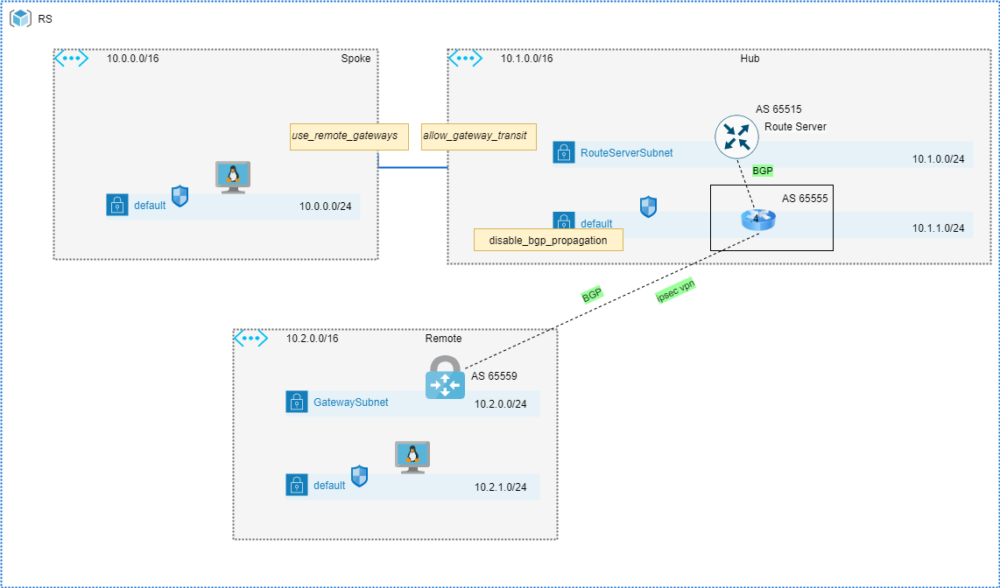

# Default route behavior in VPN Gateway and RouteServer scenario
In the provided lab, we examined the result of the Default Route (BGP 0.0.0.0/0), originating from NVA on the Hub VNET and being advertised on both the Route Server and VPN Gateway over the IPSEC VPN.

## Overview


All BGP peers have a default route artificially injected by using the "default-originate" statement on Cisco CSR. 
```cisco
router bgp 65555
 bgp log-neighbor-changes
 neighbor 10.1.0.4 remote-as 65515
 neighbor 10.1.0.4 ebgp-multihop 255
 neighbor 10.1.0.4 disable-connected-check
 neighbor 10.1.0.4 default-originate
 neighbor 10.1.0.5 remote-as 65515
 neighbor 10.1.0.5 ebgp-multihop 255
 neighbor 10.1.0.5 disable-connected-check
 neighbor 10.1.0.5 default-originate
 neighbor 10.2.0.4 remote-as 65559
 neighbor 10.2.0.4 ebgp-multihop 255
 neighbor 10.2.0.4 update-source Loopback0
 neighbor 10.2.0.4 default-originate
 neighbor 10.2.0.5 remote-as 65559
 neighbor 10.2.0.5 ebgp-multihop 255
 neighbor 10.2.0.5 update-source Loopback0
 neighbor 10.2.0.5 default-originate
```

Because Terraform AzureRM provider did not have Route Server support at the time of writing this document, I employed local provisioner instead. You can find more information about local provisioner here. https://www.terraform.io/docs/language/resources/provisioners/local-exec.html#interpreter-examples

By using the os_profile / custom_data declaration, a CSR configuration is generated and injected during creation.

You must create SSH keys in advance and upload them to Azure SSH keys. The same holds true for usernames, passwords, and shared keys. See data.tf for details. 

Resource Group | Keyvault / storage | Key
------------ | ------------- | ---
CloudShell | cs-keystore | adminusername
CloudShell | cs-keystore | adminpassword
CloudShell | ssh keys | desktop
CloudSehll | cs-keystore | sharedkey

## Topology



## Deployment

From the infrastructure folder run the following commands:
```
terraform init
terraform plan 
terraform apply
```

Active routes can be extracted from the deployed VMs by using the active_routes.sh script in the supplementals folder. 

## Observations

There is no apparent difference between the observed behavior and what is expected. There is no difference between hub, spoke and remote VNETs because default route is installed in all of them. This, by the way, means that Route Server and VPN Gateway respect the default route. 

For your reference, here are some of the outputs that we gathered.
 
#### Cisco CSR as an NVA

As you see default route is present in BGP table as locally-originated route. Default route advertised to both RS and VPN gateway peers. 

```cisco
CSR0#sh ip bgp summ
BGP router identifier 192.168.100.0, local AS number 65555
BGP table version is 14, main routing table version 14
4 network entries using 992 bytes of memory
7 path entries using 952 bytes of memory
3/2 BGP path/bestpath attribute entries using 864 bytes of memory
2 BGP AS-PATH entries using 48 bytes of memory
0 BGP route-map cache entries using 0 bytes of memory
0 BGP filter-list cache entries using 0 bytes of memory
BGP using 2856 total bytes of memory
BGP activity 5/1 prefixes, 17/10 paths, scan interval 60 secs
4 networks peaked at 02:50:22 Nov 1 2021 UTC (5d00h ago)

Neighbor        V           AS MsgRcvd MsgSent   TblVer  InQ OutQ Up/Down  State/PfxRcd
10.1.0.4        4        65515    7300    7039       14    0    0 4d10h           2
10.1.0.5        4        65515    7290    7020       14    0    0 4d10h           2
10.2.0.4        4        65559    5571    5375       14    0    0 3d09h           1
10.2.0.5        4        65559    7264    7007       14    0    0 4d09h           1

CSR0#sh ip bgp
BGP table version is 14, local router ID is 192.168.100.0
Status codes: s suppressed, d damped, h history, * valid, > best, i - internal, 
              r RIB-failure, S Stale, m multipath, b backup-path, f RT-Filter, 
              x best-external, a additional-path, c RIB-compressed, 
              t secondary path, L long-lived-stale,
Origin codes: i - IGP, e - EGP, ? - incomplete
RPKI validation codes: V valid, I invalid, N Not found

     Network          Next Hop            Metric LocPrf Weight Path
      0.0.0.0          0.0.0.0                                0 i
 *    10.0.0.0/16      10.1.0.5                               0 65515 i
 *>                    10.1.0.4                               0 65515 i
 *    10.1.0.0/16      10.1.0.5                               0 65515 i
 *>                    10.1.0.4                               0 65515 i
 *    10.2.0.0/16      10.2.0.4                               0 65559 i
 *>                    10.2.0.5                               0 65559 i
CSR0#

CSR0#sh ip bgp 0.0.0.0/0
BGP routing table entry for 0.0.0.0/0, version 5
Paths: (1 available, no best path)
  Advertised to update-groups:
     2         
  Refresh Epoch 1
  Local, (default-originate)
    0.0.0.0 from 0.0.0.0 (192.168.100.0)
      Origin IGP, localpref 100, external
      rx pathid: 0, tx pathid: 0x0
      Updated on Nov 1 2021 02:50:22 UTC

CSR0#sh bgp update-group 2

BGP version 4 update-group 2, external, Address Family: IPv4 Unicast
  BGP Update version : 14/0, messages 0, active RGs: 1
  Unconditional default-originate
  Topology: global, highest version: 14, tail marker: 14
  Format state: Current working (OK, last minimum advertisement interval)
                Refresh blocked (not in list, last not in list)
  Update messages formatted 39, replicated 48, current 0, refresh 0, limit 1000, mss 1328, SSO is disabled
  Number of NLRIs in the update sent: max 2, min 0
  Minimum time between advertisement runs is 30 seconds
  Has 4 members:
   10.1.0.4         10.1.0.5         10.2.0.4         10.2.0.5        

```

#### VM in the Spoke VNET

```
>./supplementals/active_routes.sh spoke-vnet-vm-vmLinux-0 RS
Source                 State    Address Prefix    Next Hop Type          Next Hop IP
---------------------  -------  ----------------  ---------------------  -------------
Default                Active   10.0.0.0/16       VnetLocal
Default                Active   10.1.0.0/16       VNetPeering
VirtualNetworkGateway  Active   10.2.0.0/16       VirtualNetworkGateway  10.1.1.5
VirtualNetworkGateway  Active   0.0.0.0/0         VirtualNetworkGateway  10.1.1.5
>
```

#### VM in the Hub VNET

```
>./supplementals/active_routes.sh hub-vnet-vm-vmLinux-0 RS
Source    State    Address Prefix    Next Hop Type    Next Hop IP
--------  -------  ----------------  ---------------  -------------
Default   Active   10.1.0.0/16       VnetLocal
Default   Active   10.0.0.0/16       VNetPeering
Default   Active   0.0.0.0/0         Internet
Default   Active   10.0.0.0/8        None
Default   Active   100.64.0.0/10     None
Default   Active   25.48.0.0/12      None
Default   Active   25.4.0.0/14       None
Default   Active   198.18.0.0/15     None
Default   Active   157.59.0.0/16     None
Default   Active   192.168.0.0/16    None
Default   Active   25.33.0.0/16      None
Default   Active   40.109.0.0/16     None
Default   Active   104.147.0.0/16    None
Default   Active   40.108.0.0/17     None
Default   Active   104.146.0.0/17    None
Default   Active   23.103.0.0/18     None
Default   Active   25.41.0.0/20      None
Default   Active   20.35.252.0/22    None
```

#### VM in Remote VNET

```
>./supplementals/active_routes.sh remote-vnet-vm-vmLinux-0 RS
Source                 State    Address Prefix    Next Hop Type          Next Hop IP
---------------------  -------  ----------------  ---------------------  -------------
Default                Active   10.2.0.0/16       VnetLocal
VirtualNetworkGateway  Active   10.0.0.0/16       VirtualNetworkGateway  10.2.0.4
VirtualNetworkGateway  Active   10.0.0.0/16       VirtualNetworkGateway  10.2.0.5
VirtualNetworkGateway  Active   192.168.100.0/32  VirtualNetworkGateway  10.2.0.4
VirtualNetworkGateway  Active   192.168.100.0/32  VirtualNetworkGateway  10.2.0.5
VirtualNetworkGateway  Active   0.0.0.0/0         VirtualNetworkGateway  10.2.0.4
VirtualNetworkGateway  Active   0.0.0.0/0         VirtualNetworkGateway  10.2.0.5
VirtualNetworkGateway  Active   10.1.0.0/16       VirtualNetworkGateway  10.2.0.4
VirtualNetworkGateway  Active   10.1.0.0/16       VirtualNetworkGateway  10.2.0.5
```

#### List of prefixes receivd by route-server

```
>az network routeserver peering list-learned-routes --routeserver RouteServer --name CSR0 --resource-group RS
{
  "RouteServiceRole_IN_0": [
    {
      "asPath": "65555-65559",
      "localAddress": "10.1.0.4",
      "network": "10.2.0.0/16",
      "nextHop": "10.1.1.5",
      "origin": "EBgp",
      "sourcePeer": "10.1.1.5",
      "weight": 32768
    },
    {
      "asPath": "65555",
      "localAddress": "10.1.0.4",
      "network": "0.0.0.0/0",
      "nextHop": "10.1.1.5",
      "origin": "EBgp",
      "sourcePeer": "10.1.1.5",
      "weight": 32768
    }
  ],
  "RouteServiceRole_IN_1": [
    {
      "asPath": "65555-65559",
      "localAddress": "10.1.0.5",
      "network": "10.2.0.0/16",
      "nextHop": "10.1.1.5",
      "origin": "EBgp",
      "sourcePeer": "10.1.1.5",
      "weight": 32768
    },
    {
      "asPath": "65555",
      "localAddress": "10.1.0.5",
      "network": "0.0.0.0/0",
      "nextHop": "10.1.1.5",
      "origin": "EBgp",
      "sourcePeer": "10.1.1.5",
      "weight": 32768
    }
  ],
  "value": null
}
```

#### List of prefixes received by VPN Gateway

```
>az network vnet-gateway list-learned-routes --resource-group RS --name VPNGW
{
  "value": [
    {
      "asPath": "",
      "localAddress": "10.2.0.4",
      "network": "10.2.0.0/16",
      "nextHop": null,
      "origin": "Network",
      "sourcePeer": "10.2.0.4",
      "weight": 32768
    },
    {
      "asPath": "65555-65515",
      "localAddress": "10.2.0.4",
      "network": "10.0.0.0/16",
      "nextHop": "192.168.100.0",
      "origin": "EBgp",
      "sourcePeer": "192.168.100.0",
      "weight": 32768
    },
    {
      "asPath": "65555-65515",
      "localAddress": "10.2.0.4",
      "network": "10.0.0.0/16",
      "nextHop": "10.2.0.5",
      "origin": "IBgp",
      "sourcePeer": "10.2.0.5",
      "weight": 32768
    },
    {
      "asPath": "65555-65515",
      "localAddress": "10.2.0.4",
      "network": "10.1.0.0/16",
      "nextHop": "192.168.100.0",
      "origin": "EBgp",
      "sourcePeer": "192.168.100.0",
      "weight": 32768
    },
    {
      "asPath": "65555-65515",
      "localAddress": "10.2.0.4",
      "network": "10.1.0.0/16",
      "nextHop": "10.2.0.5",
      "origin": "IBgp",
      "sourcePeer": "10.2.0.5",
      "weight": 32768
    },
    {
      "asPath": "65555",
      "localAddress": "10.2.0.4",
      "network": "0.0.0.0/0",
      "nextHop": "192.168.100.0",
      "origin": "EBgp",
      "sourcePeer": "192.168.100.0",
      "weight": 32768
    },
    {
      "asPath": "65555",
      "localAddress": "10.2.0.4",
      "network": "0.0.0.0/0",
      "nextHop": "10.2.0.5",
      "origin": "IBgp",
      "sourcePeer": "10.2.0.5",
      "weight": 32768
    },
    {
      "asPath": "",
      "localAddress": "10.2.0.4",
      "network": "192.168.100.0/32",
      "nextHop": null,
      "origin": "Network",
      "sourcePeer": "10.2.0.4",
      "weight": 32768
    },
    {
      "asPath": "",
      "localAddress": "10.2.0.4",
      "network": "192.168.100.0/32",
      "nextHop": "10.2.0.5",
      "origin": "IBgp",
      "sourcePeer": "10.2.0.5",
      "weight": 32768
    },
    {
      "asPath": "",
      "localAddress": "10.2.0.5",
      "network": "10.2.0.0/16",
      "nextHop": null,
      "origin": "Network",
      "sourcePeer": "10.2.0.5",
      "weight": 32768
    },
    {
      "asPath": "65555-65515",
      "localAddress": "10.2.0.5",
      "network": "10.0.0.0/16",
      "nextHop": "192.168.100.0",
      "origin": "EBgp",
      "sourcePeer": "192.168.100.0",
      "weight": 32768
    },
    {
      "asPath": "65555-65515",
      "localAddress": "10.2.0.5",
      "network": "10.0.0.0/16",
      "nextHop": "10.2.0.4",
      "origin": "IBgp",
      "sourcePeer": "10.2.0.4",
      "weight": 32768
    },
    {
      "asPath": "65555-65515",
      "localAddress": "10.2.0.5",
      "network": "10.1.0.0/16",
      "nextHop": "192.168.100.0",
      "origin": "EBgp",
      "sourcePeer": "192.168.100.0",
      "weight": 32768
    },
    {
      "asPath": "65555-65515",
      "localAddress": "10.2.0.5",
      "network": "10.1.0.0/16",
      "nextHop": "10.2.0.4",
      "origin": "IBgp",
      "sourcePeer": "10.2.0.4",
      "weight": 32768
    },
    {
      "asPath": "65555",
      "localAddress": "10.2.0.5",
      "network": "0.0.0.0/0",
      "nextHop": "192.168.100.0",
      "origin": "EBgp",
      "sourcePeer": "192.168.100.0",
      "weight": 32768
    },
    {
      "asPath": "65555",
      "localAddress": "10.2.0.5",
      "network": "0.0.0.0/0",
      "nextHop": "10.2.0.4",
      "origin": "IBgp",
      "sourcePeer": "10.2.0.4",
      "weight": 32768
    },
    {
      "asPath": "",
      "localAddress": "10.2.0.5",
      "network": "192.168.100.0/32",
      "nextHop": null,
      "origin": "Network",
      "sourcePeer": "10.2.0.5",
      "weight": 32768
    },
    {
      "asPath": "",
      "localAddress": "10.2.0.5",
      "network": "192.168.100.0/32",
      "nextHop": "10.2.0.4",
      "origin": "IBgp",
      "sourcePeer": "10.2.0.4",
      "weight": 32768
    }
  ]
}
```

